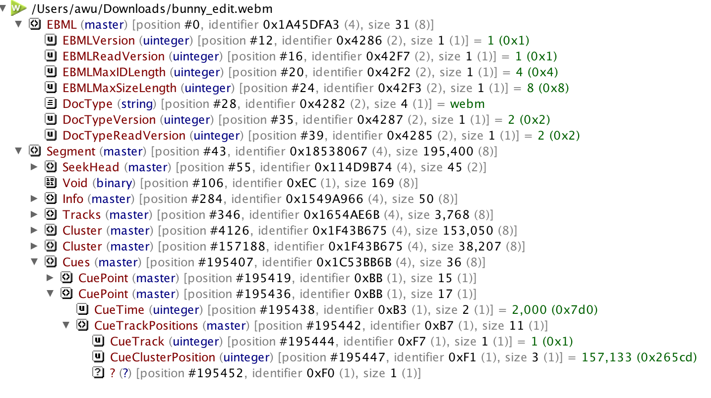
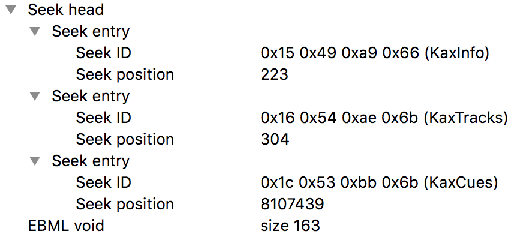
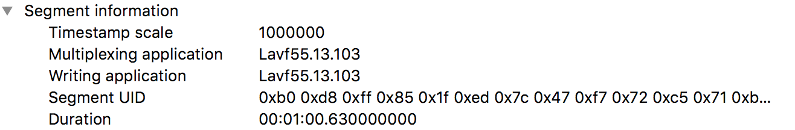
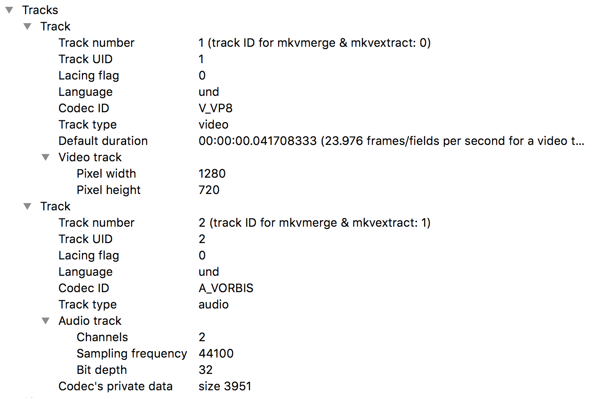
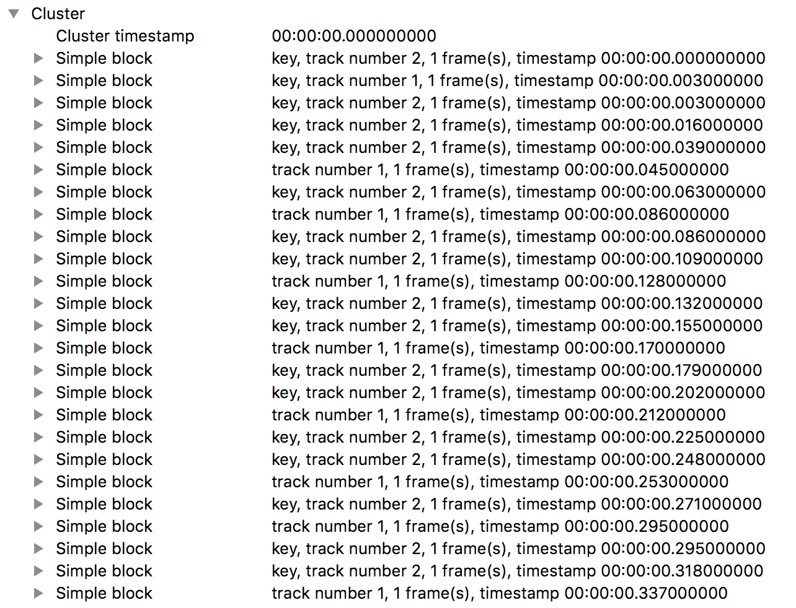
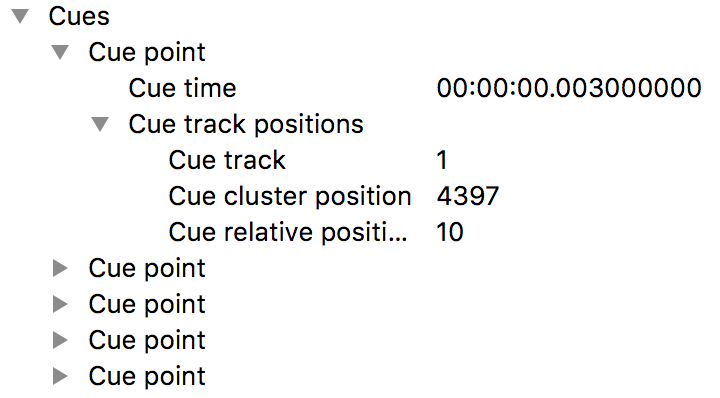

# WebM

`WebM` 是一套基於 `Matroska` 的開放視訊容器格式，目前為已廣泛被各大瀏覽器所支援。而影片中可支援的視訊編碼格式為`vp8` 與 `vp9`，音訊編碼格式為 `vorbis` 與 `opus`。

`WebM` 格式是 `Matroska` 的子集，並不是支援全部的屬性，更多細節請參考 [`WebM標準`](https://www.webmproject.org/docs/container/)。

## EMBL
`EMBL` 是 `Extension Machine Binary Language` 的縮寫，是一套用於定義二進位碼且遵循 `8 bits` 對齊的[文件標準](https://github.com/Matroska-Org/ebml-specification)。而 `Matroska` 就是一套遵循 `EMBL` 所設計的格式。`8 bits` 對齊的意思是，格式內的最小基本單位就是 `8 bits`，也就是一個 `byte`。

在 `Matroska` 裡的每個元素，開頭都會有一個 `EMBL ID`(或 `Element ID`)，用來辨識元素的內容。而 `EMBL ID` 的長度是可變的，一到四個 `byte` 都有可能。

```
bits, big-endian
1xxx xxxx                                  - Class A IDs (2^7 -1 possible values) (base 0x8X)
01xx xxxx  xxxx xxxx                       - Class B IDs (2^14-1 possible values) (base 0x4X 0xXX)
001x xxxx  xxxx xxxx  xxxx xxxx            - Class C IDs (2^21-1 possible values) (base 0x2X 0xXX 0xXX)
0001 xxxx  xxxx xxxx  xxxx xxxx  xxxx xxxx - Class D IDs (2^28-1 possible values) (base 0x1X 0xXX 0xXX 0xXX)
```

而其中每個元素的 `Data Size`，從一到八 `byte` 不等，最大支援到 `2^56-2` 的大小。

```
bits, big-endian
1xxx xxxx                                                                              - value 0 to  2^7-2
01xx xxxx  xxxx xxxx                                                                   - value 0 to 2^14-2
001x xxxx  xxxx xxxx  xxxx xxxx                                                        - value 0 to 2^21-2
0001 xxxx  xxxx xxxx  xxxx xxxx  xxxx xxxx                                             - value 0 to 2^28-2
0000 1xxx  xxxx xxxx  xxxx xxxx  xxxx xxxx  xxxx xxxx                                  - value 0 to 2^35-2
0000 01xx  xxxx xxxx  xxxx xxxx  xxxx xxxx  xxxx xxxx  xxxx xxxx                       - value 0 to 2^42-2
0000 001x  xxxx xxxx  xxxx xxxx  xxxx xxxx  xxxx xxxx  xxxx xxxx  xxxx xxxx            - value 0 to 2^49-2
0000 0001  xxxx xxxx  xxxx xxxx  xxxx xxxx  xxxx xxxx  xxxx xxxx  xxxx xxxx  xxxx xxxx - value 0 to 2^56-2
```

從第一個 `byte` 中 `1` 的位置，可以推斷出 `EMBL ID` 或 `Data Size` 的長度。

## EMBL Tree

`EMBL` 中將元素分成不同的層級，從 `Level 0` 到 `Level 4`。 `Level 0` 代表出現在最上層的父元素，裡面會包含 `Level 1` 的子元素，而 `Level 1` 又會包含 `Level 2` 的子元素，以此類推。



`Level 0` 只有兩種元素，且出現的順序也是固定的。`EMBL` 元素一定需要第一個出現，裡面包含了 `EMBL` 相關的資訊。上圖中 `EMBL` 出現在 `position #0` 的位置，且 `identifier` (`EMBL ID`) 為 `0x1A45DFA3`，`data size` 為 `31 bytes`。

接下來第二個 `level 0` 的元素為 `Segment`，本身並沒有太多內容，主要是當作其他資料的 `root`。

## Elements Level 1 Elements Overview

### SeekHead
因為 `EMBL` 並沒有強制規定 `level` 元素出現的先後順序，他們可以出現在任意的位置中。`SeekHead` 紀錄了 `EMBL Tree` 中其他元素的位置，讓找尋其他元素的時候更方便，不需要去重新查找所有的 `level 1` 元素。



### Segment Info
包含了整個檔案的基本訊息，例如時間單位、影片長度等等。



### Tracks
包含了每個 `track` 的詳細內容，可能會是 `audio`、`video` 或是 `subtitle`。



### Chapters
可以預先定義好 `audio` 或 `video` 的位置，藉著 `chapter` 快速跳轉至指定的地方。例如，看 `DVD` 時常會出現設定好的章節選單。

### Cluster
存放 `audio data` 與 `video data` 的地方，一個檔案裡通常都會有許多個 `Cluster`，每個 `Cluster` 裡面都會包含 `Simple block` 或是 `Block group`，每個 `block` 中存放實際的影音資料。



### Cues
`Cues` 是影片的 `seek table`，裡面包含若干個 `cue point`，每個 `cue point` 會紀錄 `video keyframe` 的位置。當使用者做 `seek` 的時候，便可以從中輕易的找到離 `seek time` 最接近的 `key frame`。



### Attachments
`Matroska` 給予了檔案相當大的彈性，在 `Attachments` 中你幾乎是可以放上任意型態的檔案。常用使用的方式為附上 `CD album` 之類的圖片。

### Tags
`Tags` 主要用來附上 `track` 相關的額外資訊，像是音樂的作曲者、影片的編輯者等等⋯⋯

## WebM Byte Stream For Media Source Extension
在 `MSE` 的使用情境中，網站並不會一次傳送完整的 `WebM` 檔案到使用者端，通常都是每次傳送一小部分的片段。當每次附加新的資料時，此份 [規範](https://www.w3.org/TR/mse-byte-stream-format-webm/) 定義了一些需要注意的事項。

### Initialization Segments
此規範定義，在開始接收影音資料前，必須先收到 `Initialization Segments`，而這其實就是我們前面提到的 `EMBL` 與 `Segment` 元素。

### Media Segments
影音檔案的資料，也就是前面提到的 `Cluster` 元素。

## 參考資料
1. [WebMProject.org](https://www.webmproject.org/docs/container/)
2. [EMBL](https://github.com/Matroska-Org/ebml-specification)
3. [WebM Byte Stream Format](https://www.w3.org/TR/mse-byte-stream-format-webm/)
